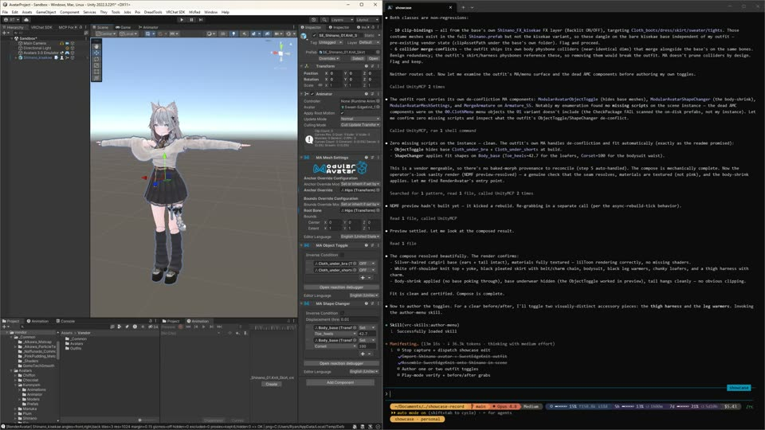
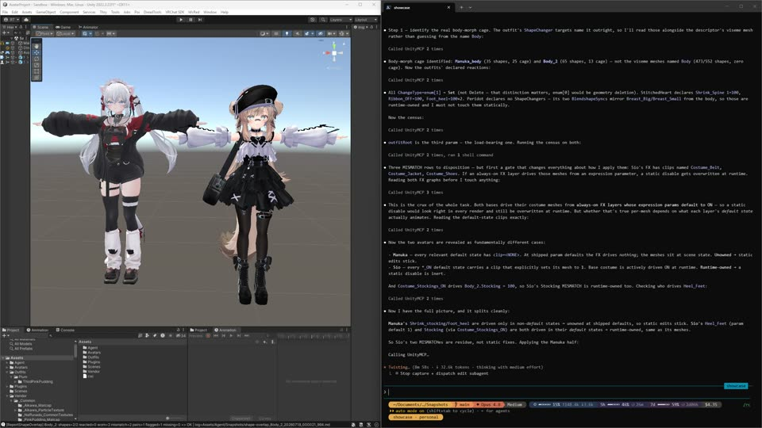
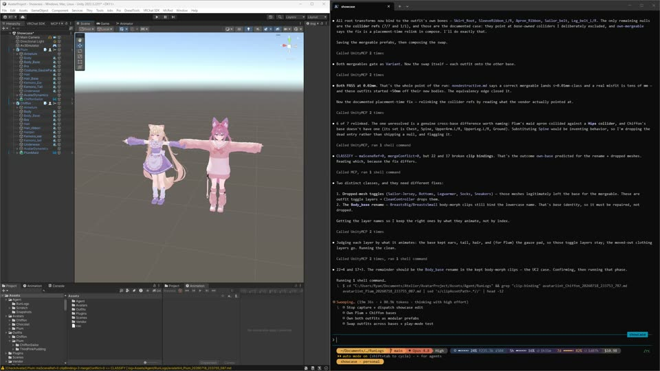
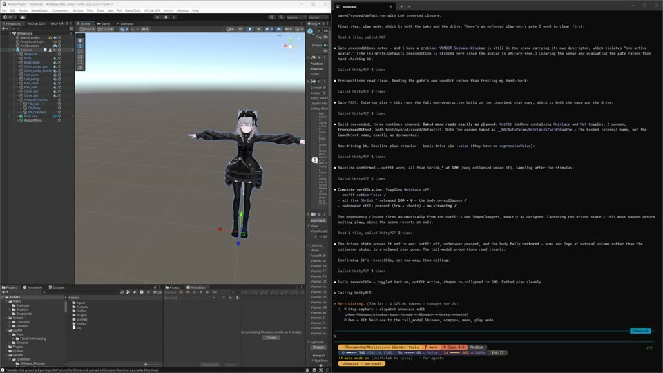
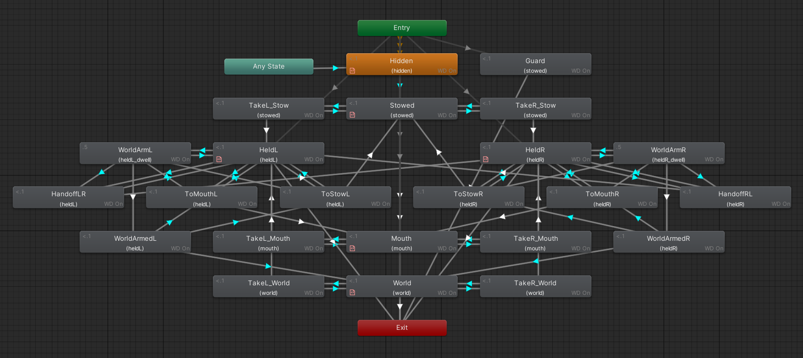

# Atelier

Atelier is a workspace where a coding agent (Claude Code) does VRChat avatar work end-to-end: it observes the live Unity scene and Blender armature, modifies them through reviewed scripts and purpose-built tools, and verifies the result. It self-drives most of my process with the organization and rigor I'd use given unlimited time. It uses a mix of:

- Carefully constructed knowledge and routing surfaces to ensure the model reaches the Unity/VRChat information it needs as efficiently as possible.
- Control of Blender and Unity via MCP, with an additional set of generic chainable tools.
- Skills that package each workflow's judgment calls into repeatable units.

The project enforces a strict non-destructive workflow and the agent is fluent in every technique this implies. Vendor assets are never modified, only *owned*: deep-copied exactly as far as a change requires. Avatars remain a modular hierarchy of non-destructive components until upload.

## Showcase

https://github.com/user-attachments/assets/f5242415-4c47-4bdc-81f2-6b9be8ca3516

> Put MidnightReverie on Airi and take six thumbnail shots in play mode. Use a different pose, expression, and background for each one and insert them in the captured footage.

Each run is one uninterrupted session — a single plain-language request in, an avatar out. Every thumbnail links to that run's full cut.

<table width="100%">
<tr><th width="33%">Cut</th><th>Prompt</th></tr>
<tr>
<td align="center"> <a href="https://pub-9682660324c24dc7be664b3245e10a3e.r2.dev/2026-07-14-shinano-sweetedgeknit/cut.mp4"><ins>Watch 1:15</ins></a></td>
<td>Please import Shinano and SweetEdgeKnit, then assemble them in the scene. Author one or two outfit toggles, enter play mode, and capture screenshots before and after.</td>
</tr>
<tr>
<td align="center"> <a href="https://pub-9682660324c24dc7be664b3245e10a3e.r2.dev/2026-07-18-manuka-stitchedheart-sio-peridot/cut.mp4"><ins>Watch 1:15</ins></a></td>
<td>I have placed a Sio and Manuka in the scene. Please put StitchedHeart in white on Manuka and Peridot in black and red on Sio, and make sure there is no clipping.</td>
</tr>
<tr>
<td align="center"> <a href="https://pub-9682660324c24dc7be664b3245e10a3e.r2.dev/2026-07-18-plum-chiffon-swap/cut.mp4"><ins>Watch 2:00</ins></a></td>
<td>Make clean copies of Plum and Chiffon, then extract their outfits as modular prefabs and swap them. Finally, pick one and bring it into play mode to test.</td>
</tr>
<tr>
<td align="center"> <a href="https://pub-9682660324c24dc7be664b3245e10a3e.r2.dev/2026-07-18-shinano-noirlace-tallmodel/cut.mp4"><ins>Watch 1:40</ins></a></td>
<td>Bring Shinano into Blender and reproportion her into a tall fashion model. Apply the same adjustment to NoirLace, assemble them in the scene, and build a menu. Organize any dynamics components as you go. Finally, take it into play mode for testing.</td>
</tr>
</table>

## Skills

These skills are how you use the workshop: invoke one by name, or just say what you want and the agent picks the right one. Each runs a complete arc of avatar work end-to-end, driving the tools catalogued at the bottom of this page; most users never need anything past this section. Together they are what this workshop can do, from a vendor `.unitypackage` to a dressed, menued, reshaped avatar live on VRChat.

| Key | Purpose |
| --- | --- |
| [`import-vendor-asset`](https://github.com/Ryan6-VRC/vrc-skills/blob/main/skills/import-vendor-asset/SKILL.md) | Bring any vendor asset (avatar, outfit, hair, accessory) into the project cleanly: handle nested zips and companion MaterialPacks, land it untouched under `Vendor/`, and machine-verify every reference before work begins. |
| [`own-base`](https://github.com/Ryan6-VRC/vrc-skills/blob/main/skills/own-base/SKILL.md) | Turn a vendor avatar into *your* avatar: graph the messy vendor package, then build a clean, normalized, uploadable base body to our conventions. Every step gated, nothing eyeballed. |
| [`own-mergeable`](https://github.com/Ryan6-VRC/vrc-skills/blob/main/skills/own-mergeable/SKILL.md) | Extract an outfit, hair, or accessory into an owned mergeable, even out of a monolithic avatar: reshaped and carrying its own MA or VRCFury non-destructive seam, so it drops onto a base exactly like the vendor original. |
| [`own-material`](https://github.com/Ryan6-VRC/vrc-skills/blob/main/skills/own-material/SKILL.md) | Change how anything looks: recolor a dress, add glitter, glow, prep a hue slider or a Poiyomi convert. Picks the right mechanism (custom textures, property adjustments, clip-driven animations) and deep-copies only what actually changes. |
| [`compose-mergeable`](https://github.com/Ryan6-VRC/vrc-skills/blob/main/skills/compose-mergeable/SKILL.md) | Dress the avatar: drop a ready-made outfit, hair, or accessory onto a base, prove the MA or VRCFury seam mechanically resolved, and de-conflict the meshes it covers. |
| [`map-outfit-shapes`](https://github.com/Ryan6-VRC/vrc-skills/blob/main/skills/map-outfit-shapes/SKILL.md) | Reconcile the links between a body's blendshapes and its clothing: which garment drives which morph, to what values, and what several meshes must agree on. Evaluates FX controllers, non-destructive components, blendshape/mesh names, and vision. |
| [`author-menu`](https://github.com/Ryan6-VRC/vrc-skills/blob/main/skills/author-menu/SKILL.md) | Give the avatar its in-game controls: expression-menu toggles, radials, and gimmick fronts, planned with the user, closed over their dependencies, and authored non-destructively. |
| [`author-gimmick`](https://github.com/Ryan6-VRC/vrc-skills/blob/main/skills/author-gimmick/SKILL.md) | Build a new gimmick from intent — a touch reaction, a held or droppable prop, synced interactive state: transport and bit design first, authored as recompilable controller text, packaged as one self-contained module, verified up the ladder. |
| [`own-gimmick`](https://github.com/Ryan6-VRC/vrc-skills/blob/main/skills/own-gimmick/SKILL.md) | Take surgical ownership of an existing gimmick module: extract the one subsystem you want, trim a vendor system, or fork a variant — with the checklist that keeps cut modules from silently resurrecting meshes, drifting params, or driving ghosts. |
| [`reproportion`](https://github.com/Ryan6-VRC/vrc-skills/blob/main/skills/reproportion/SKILL.md) | Reshape proportions to taste (longer arms, a custom body, matching your real measurements so IK feels right) as validated, repeatable profiles, with the Unity side reconciled so nothing downstream breaks. |
| [`shoot-thumbnail`](https://github.com/Ryan6-VRC/vrc-skills/blob/main/skills/shoot-thumbnail/SKILL.md) | Generate your avatar's upload thumbnail as a staged portrait — your choice of dynamic pose, expression, and background, or a look the agent picks to suit the avatar and its outfit. |
| [`upload-avatar`](https://github.com/Ryan6-VRC/vrc-skills/blob/main/skills/upload-avatar/SKILL.md) | The last mile to VRChat: preflight the batch, confirm names and scope, and drive the operator-authorized upload, including re-uploading the ten avatars that inherit one changed base. |
| [`showcase-record`](https://github.com/Ryan6-VRC/vrc-skills/blob/main/skills/showcase-record/SKILL.md) | Film a work session (ffmpeg screen capture) and cut it into a short showcase video. |
| [`fitting-session`](https://github.com/Ryan6-VRC/vrc-skills/blob/main/skills/fitting-session/SKILL.md) | Wear-test the workshop itself: dispatch worker agents on real vendor-asset tasks, grade independently, distill the sharp edges into a cross-run ledger + fixup kickoffs. |

## Controller authoring

The fluency above forms the common-sense layer required to do useful VRChat work, but is not the ultimate objective of the project. Atelier includes all the tooling needed to apply **frontier model coding aptitude** to controller and gimmick authoring.

- **Decoded structure.** Animator, constraint, physbone, and contact topology arrive as read-only graph digests (`ReportController`, `ReportGimmick`, `CheckAnimator`), so the model reasons over decoded structure instead of raw unity files.
- **Controllers as code.** `DecompileController` and `CompileController` round-trip a built `.controller` to declarative YAML: reviewable, diffable text, the representation coding models are strongest in. Study a vendor controller, modify it, or author a new system from scratch.
- **A closed validation loop.** The emulator lets the agent drive parameters, frame-step, induce physbone grabs, fake another player's contacts, and spawn remote clones; so it can self-test its work in play mode and iterate instead of asserting.

## Pattern library

The [`vrc-patterns`](https://github.com/Ryan6-VRC/vrc-patterns) library is both evidence of the system's capabilities and a resource agents can draw on. It contains a mix of known systems normalized into documented NDMF modules as well as new creations, with a lot more to come. When asked to understand, modify, or author a gimmick the patterns library provides deep domain knowledge and tested working designs to copy or compare against. Browse by [what you want to build](https://github.com/Ryan6-VRC/vrc-patterns#find-by-what-you-want-to-build).

## Tools for AI

Most Unity plugins and Blender scripts are designed for humans, so they hide complexity behind clever defaults. Tooling built for an AI operator inverts that: legibility beats edge-case cleverness. If a tool cannot do exactly what was asked, it refuses and explains why, so the driving model can understand and adapt. This makes the system robust to the enormous variety of creator assets; there are no brittle hard-coded workarounds to outgrow.

The same philosophy governs the workspace's own working process: project skills in [`.claude/skills/`](.claude/skills/) — [`write-for-agents`](.claude/skills/write-for-agents/SKILL.md) for the writing craft in every doc, skill, and diagnostic an agent will read; [`kickoff`](.claude/skills/kickoff/SKILL.md) and [`dispatch`](.claude/skills/dispatch/SKILL.md) for authoring work briefs and coordinating worker sessions. (They live in this repo, not the plugin — the skills table above is the workshop's avatar workflows.)

## Repos

Cloning this meta-repo gets you the docs + launcher, **not** the tools; each **tool** repo below is its own independent git repo, gitignored here as a sibling you clone into place. `AvatarProject` (last) is different — an untracked Unity working venue, not a tracked repo.

- **[`vrc-unity-tools/`](https://github.com/Ryan6-VRC/vrc-unity-tools)** — Unity editor packages (UPM): the agent inspection/verification harness (`agent-tools`) and the vendor→owned transplant kit (`avatar-tools`). Editor-only, SDK-gated, tested.
- **[`vrc-blender-tools/`](https://github.com/Ryan6-VRC/vrc-blender-tools)** — the `avatarprep` Blender extension: shape-key-safe rest-pose bake, proportion profiles, armature merge/prune, Unity FBX export. Blender 5.1+, with an N-panel for humans and headless CLIs for agents over the same core.
- **[`vrc-skills/`](https://github.com/Ryan6-VRC/vrc-skills)** — the Claude Code skills plugin: the import / own / compose / reproportion / menu workflows as repeatable, gated units of work.
- **[`vrc-patterns/`](https://github.com/Ryan6-VRC/vrc-patterns)** — a VPM library of reusable, verified avatar patterns, controllers, and drop-in gimmick modules: YAML-sourced (`CompileController`), gated on compile→decompile-equality, with built assets committed only where a prefab references them by GUID. [**Browse the catalog**](https://github.com/Ryan6-VRC/vrc-patterns#find-by-what-you-want-to-build) to find an entry by what you want to build.
- **[`vrc-bridge/`](https://github.com/Ryan6-VRC/vrc-bridge)** — a Python runtime bridge between SteamVR controller input and VRChat OSC: zero-config discovery (OSCQuery/mDNS), hot-swappable control mappings, camera-system routing.
- **[`vrc-mcp-proxy/`](https://github.com/Ryan6-VRC/vrc-mcp-proxy)** — an owned stdio MCP interception proxy wrapping the pinned MCP-for-Unity server: validates the upstream tool schemas against a committed baseline, allowlists the tools the agent uses, and applies per-tool request/response transforms so a class of upstream sharp edges is corrected at the moment of failure.
- **[`AvatarProject/`](https://github.com/Ryan6-VRC/AvatarProject)** — an **untracked** Unity working venue (2022.3.22f1, VRChat Avatars SDK via VPM/ALCOM) where the loop runs against real avatar setups. The linked public repo is a stripped **sample skeleton** to seed a fresh clone from (bootstrap removes its `.git`), not the tracked project. One instance of the workspace's conventions, not the only one; stand up more via [`docs/new-project.md`](docs/new-project.md).

## Get the workspace running

To assemble the full workspace on a bare machine (clone the sub-repos, install and wire Unity · Blender · the MCP bridges, then verify), point a capable agent at **[`docs/bootstrap.md`](docs/bootstrap.md)**. Prereqs at a glance: Unity Hub + 2022.3.22f1, Blender 5.1+, `git`/`git-lfs`, `uv`, `vrc-get`/ALCOM, Python 3.10+, Claude Code.

## Tools

_The tool surface the skills above drive. Generated from `TOOLS.md`._

<!-- BEGIN tools -->
<!-- generated from TOOLS.md — edit TOOLS.md, not here -->

Every agent-facing tool across `vrc-unity-tools` / `vrc-blender-tools`, one row each. Rows are routing, not contracts; behavior lives in `docs/unity-tools.md` / `docs/animator.md` (controllers & clips) / `docs/blender.md`. The pre-commit hook `tools/sync_tool_inventory.py` verifies each key against its code declaration site (Unity `[AgentTool]` classes, Blender operator names ∪ `cli/` stems) and mirrors this file into `README.md`; it never writes a row itself. The agent landing a tool change updates its row by hand at merge (the hook skips worktrees).

## vrc-unity-tools

### vrc-unity-tools · inspect & verify (read-only)

| Key | Purpose |
| --- | --- |
| `AgentInspector` | JSON snapshot of a scene object (by hierarchy path or selection) or the whole scene; a generic walk over any component. |
| `RenderAvatar` | Isolated Scene-View render of one avatar subtree, NDMF-preview-resolved, to a contact-sheet PNG. Two doors: `Capture` is **operator-eye evidence only** — a model-read of the sheet is never a fit or clipping verdict — and `CaptureDiff`, the pinned-camera exact differential (`verify.md`'s sanctioned form), the only door whose output settles a decision. Contract: `unity-tools.md`. |
| `CheckPackage` | Post-import health check: missing (vs. intentionally empty) material/mesh/script refs, plus stale FBX material remaps. |
| `ReportPackage` | Vendor-package report: FBX/mesh inventory, the superset FBX, clip-driven toggle membership, and `nonSdkNs=` — a verbatim non-SDK-namespace census that names no framework and counts the components whose scripts did not resolve. Both of those fields state their own reach rather than claiming coverage; contract: `unity-tools.md`. |
| `CheckHumanoidRig` | Gate: does the humanoid bind still match the model geometry, or must `MatchHumanoidRig` re-run? |
| `ReportController` | Markdown digest of an `AnimatorController`: parameters, layers with Write Defaults, states, transitions, blend trees, motions by path + GUID (dangling refs flagged empty-vs-broken at any depth, including inside blend trees), VRC behaviours decoded typed. Contract: `animator.md`. |
| `ReportClip` | Binding digest of a clip, or of every `.anim` under a folder: one row per curve (`path \| type \| propertyName \| keys`). Contract: `animator.md`. |
| `CheckAnimator` | PASS/FAIL plus tiered offenders for mechanically-detectable controller rot; the binding-resolution root is auto-detected from a merge site or asserted explicitly. Contract: `animator.md`. |
| `CheckAvatar` | On a placed in-scene avatar root, names the MA scene refs and clip/controller bindings a base rename silently broke, the `anchor-seam` bindings a cross-framework build-time move will kill (the one class that predicts the bake instead of reading the scene), plus dynamics `merge-conflict`s (≥2 physbones/colliders/constraints resolving to one post-merge transform); PASS/CLASSIFY, inspection-only. Each clip-binding break carries its `clipAssetPath` so the caller can route between repathing inline and owning the asset. |
| `CheckSeam` | On a base + placed mergeable, reflects the MA/VRCFury seam mapping and gates world-position coincidence of weighted humanoid bones within tolerance, naming worst-first offenders. Certifies the humanoid skeleton coincides, not accessory placement; inspection-only, the mechanical fit gate to run before any render. |
| `ReportShapeOverlap` | Same-mesh blendshape overlap: per-shape touched-vertex footprints, pairwise containment, and a resolution table (reaction / current weight / resolved-target). Catches the double-subtraction a worn base `Shrink_*` and an outfit `ShapeChanger` stack over the same vertices — invisible to the render sheet and CheckSeam/CheckAvatar. Assembles its own co-active set, but ingests the weight-0 MA `ShapeChanger` reactions only when passed the outfit root. A report, not a verdict; `map-outfit-shapes` drives it and owns the disposition. |
| `ReportGimmick` | Topology digest of a gimmick subtree: contact/physbone/raycast/constraint tables, a constraint edge-list spanning both VRC and Unity constraint families (driven/sources, weights, axes), VRCFury authoring inventory, and the mechanically-certain idioms (world anchor, feedback loop, indirection, hold, editor/runtime swap, physbones sharing one target). Complete by construction — a tier-2 census names every component no table interpreted, so `other=0` means empty. Each physbone row also censuses its `chain subtree` (bones, how many a renderer skins, how many host another component) — reported, never a dead-chain verdict. The raycast table renders `layers` index-first (a name is only ever the project's TagManager annotation, never the component's own) and `result` as `(none)` rather than a silently absent line. |

### vrc-unity-tools · vendor import

| Key | Purpose |
| --- | --- |
| `ImportPackage` | The heavy-import door, two-phase so the result survives a transport timeout: `Import(path)` kicks off the async `.unitypackage` import and returns `PENDING` at a stable RunLog path (`whatIf` validates only); `Verify(path, expectedRoot?)` re-reads that log and walks the on-disk root for a PASS/PENDING/FAIL verdict authoritative over the callback status, routing deep health to `CheckPackage`. |

### vrc-unity-tools · transplant kit (vendor → owned)

| Key | Purpose |
| --- | --- |
| `CopyComponents` | Type-driven component copy between hierarchies (a deep VRC tier plus a conservative tier). |
| `MoveComponents` | Move components onto a new holder hierarchy with anchors pinned back; behavior-neutral. |
| `GraftHierarchy` | Copy a named subtree wholesale: structure plus all components, refs remapped. |
| `CopyDescriptor` | Transplant the VRC avatar descriptor, with a fresh PipelineManager. |
| `FixViewpoint` | Recompute `ViewPosition` from a reference rig's viewpoint plus both rigs' Head/eyes. |
| `MatchHumanoidRig` | Conform our humanoid rig to the vendor's bone mapping; `Preflight` previews. |
| `ConformRenderers` | Copy materials by renderer name from a source hierarchy and normalize bounds/anchor (optional `ownedToSource` override map — direction is the reverse of the transplant kit's). |
| `OwnMaterial` | Own a vendor material: deep-copy it (or branch/augment an already-owned one), fork the named texture slots into the copy's own subfolder, and unlock a locked-Poiyomi copy — every unforked slot stays on its vendor GUID. The skill chooses which slots; the tool's `slots[]` provenance table is the caller's gate. |

### vrc-unity-tools · controllers & clips

| Key | Purpose |
| --- | --- |
| `CleanController` | Reset an owned avatar's FX to a blank slate: keep named layers (plus base layer 0), empty params/menu, wire the descriptor. For anything richer, decompile, edit, and recompile instead. |
| `RepathClips` | Segment-safe repath of a controller's owned clip bindings; the caller supplies the moves. |
| `OwnControllerClips` | Fork vendor-linked clips to owned copies and retarget the controller's motion slots. |
| `CompileController` | The animator **write substrate**: compiles a declarative YAML document into a persisted `.controller`, plus inline clips, embedded blend trees, a `VRCExpressionParameters` asset, and a `VRCExpressionsMenu` when the document declares a `menu:`. Atomic, idempotent (stable GUID), `whatIf`-previewable; every build passes the shared graph lint. Schema: [`docs/animator-schema.md`](docs/animator-schema.md). |
| `DecompileController` | The animator **read substrate**, inverse of `CompileController`: walks a built `.controller` back to animator-schema YAML, never mutating it; refuses out-of-vocabulary constructs by name. `Decompile → edit → Compile` is the lossless round-trip **for the controller graph** — it does not recover a `menu:` block, so recompiling a decompiled document into the folder it came from deletes the menu asset there (loudly; `animator-schema.md` §menu). |
| `CompileClips` | The **external-clip write door**: compiles a clips-file YAML (top-level `clips:`, no `layers:`) into standalone, *visible* `.anim` assets a controller references by `ref:` path — where `OwnControllerClips` copies existing clips, this authors them. Emit-only, so deleting a clip from the file *promotes* it to human ownership; refuses to clobber a hand-edited clip (`force` overrides). |
| `NormalizeExpressionClips` | Make expression clips share one binding/key-time set; optionally prune unused curves. |

### vrc-unity-tools · scene utilities

| Key | Purpose |
| --- | --- |
| `RemapMaterials` | Swap materials by asset path across a hierarchy. |
| `ConstrainedDuplicate` | Clone a hierarchy and wire VRC constraints between original and duplicate bones. |

### vrc-unity-tools · publish

| Key | Purpose |
| --- | --- |
| `UploadAvatar` | Batch-upload composed avatars live to VRChat, driving Continuous Avatar Uploader by reflection (optional; absent → REFUSE with the fix). Operator-gated, never autonomous; `whatIf` previews readiness without uploading. |
| `RenderThumbnail` | Baked posed portrait for an avatar's upload thumbnail — 1200x900 PNG, **edit-mode** default: bakes the **full VRC SDK preprocess chain** (optimizers included), so it shows what actually uploads; `RenderAvatar` never bakes. One deterministic synchronous call. `pose` and optional `expression` are names, and an unknown one enumerates. `png=` feeds `UploadAvatar`. |
| `RenderThumbnailPlay` | Same thumbnail from **play mode** — hair/cloth **settled** by the real physbone solver, FX toggles/materials **resolved**; same caller vocabulary, shared spine (`RenderThumbnailCore`). A play **session**: `Begin` → `manage_editor play` → `Shoot` (async; poll `Status()`) → `manage_editor stop` → `End`. Names any chain **still moving** at capture. `unity-tools.md` §Thumbnails. |

## vrc-blender-tools

### vrc-blender-tools · inspect & verify (read-only)

| Key | Purpose |
| --- | --- |
| `report_stamps` | Read a `.blend`'s avatarprep provenance: per-armature base/state (plus kind) and each bound mesh's `avatarprep_baked` map; `--shapekeys [SUBSTR]` additionally lists shape-key **names** per mesh, not just counts. The query counterpart of `stamp_base`. |
| `compare_armatures` | Seam check: do two rigs share bone names, parents, positions, base, and state? The merge dry-run. Position verdicts are two-tiered — beyond `--noise-tol` gates the merge, between it and `--tol` is reported noise — because two separately-authored vendor FBXes carry sub-millimetre rounding a single threshold false-FAILs on. `--merge-in` compares across two files. |
| `render_mesh` | Headless contact-sheet render of the scene's render-visible meshes from named world-axis angles (`front,back,left,right,top,bottom` — an unknown one FAILs in-grammar), solid or vertex-color shading; `RenderAvatar`'s Blender sibling. Writes to a pruned temp home by default, or `--out`. |

### vrc-blender-tools · armature & mesh ops

| Key | Purpose |
| --- | --- |
| `apply_pose` | Bake the current pose into the rest pose, shape-key-safe. |
| `merge_armatures` | Union-merge two armatures by bone name behind the compat gate; gates on base and state (`force_stamps` overrides the stamp gate, `whatif` previews), on `compare_armatures`' two-tier position thresholds, and warns when the two rigs' object rotations/origins disagree — there it bakes the world frame and the merged rig matches neither source's vendor orientation. |
| `prune_bones` | Prune zero-weight bone chains, keeping physbone tips (`whatif` previews the removals as rooted chains); refuses when an object rides a doomed bone unless `force`. |
| `bake_shapekey` | Normal-preserving shape-key→Basis bake; records `avatarprep_baked`. Refuses the head mesh by a **name** list (`--head-mesh-names`, default `Body`) standing in for a geometric check — overriding it asserts where the head lives on this rig. |
| `stamp_base` | Stamp `avatarprep_base` (avatar lineage) on an armature; a deliberate agent assertion. |

### vrc-blender-tools · proportions & export

| Key | Purpose |
| --- | --- |
| `apply_proportion_edge` | Apply one declarative proportion edge, validating first and stamping state; `--whatif` validates read-only against the live scene. |
| `import_fbx` | Import an FBX via Blender's current importer (never the legacy one, which reorients bones); stamps new armatures state="unproportioned" and returns a sanity snapshot, including the source file's `unit_scale_factor` (read from the file — the importer normalizes both unit classes into identical scene state). `export_unity_fbx`'s counterpart. |
| `export_unity_fbx` | Export with the Unity/VRChat FBX recipe onto one canonical layout (`FBX_SCALE_ALL`, meter-unit) rather than mimicking the source's unit class; refuses a non-unit scene scale. Clears each armature's object rotation unapplied so the importer's axis-convention residue is not double-counted (`--keep-object-rotation` for a deliberately rotated rig). `--armature` scopes an owned re-export to one rig (selection-only, no texture embed). Orientation has a second switch Unity-side — see `blender.md`. |

<!-- END tools -->
